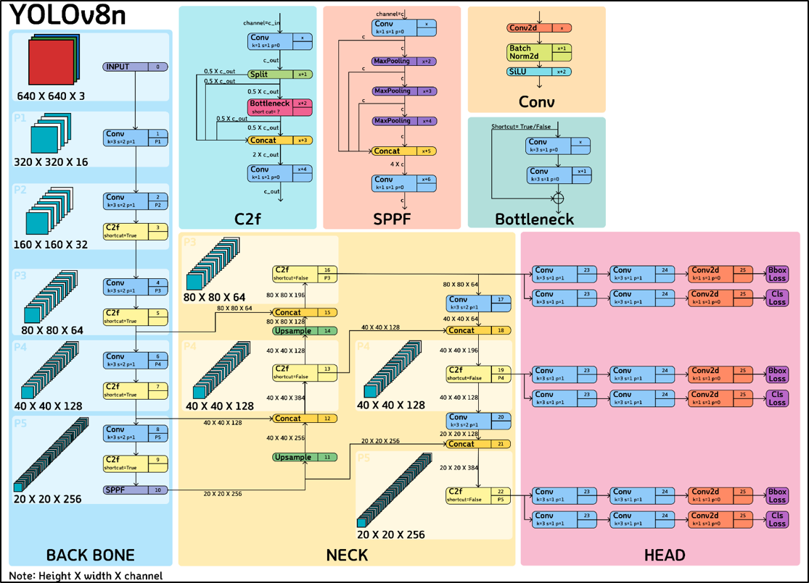
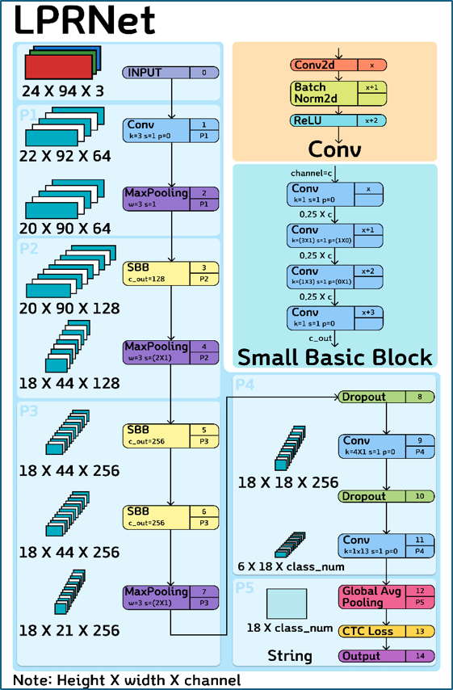
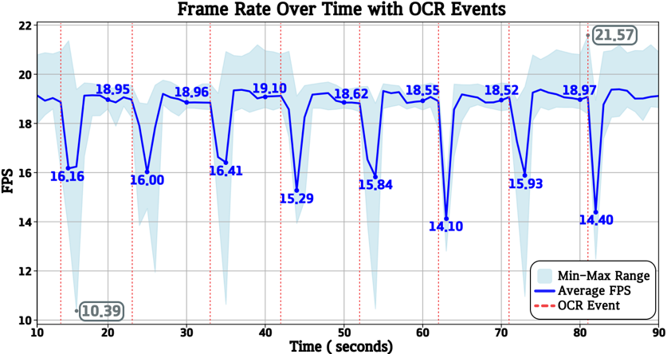

# Real-Time License Plate Recognition Using YOLOv8n and Coral Edge TPU

> 실시간 객체 탐지 및 번호판 인식을 위한 Edge AI 시스템  
> Raspberry Pi 5 + Coral USB Edge TPU 환경에서 YOLOv8n + LPRNet으로 구현  

---

## Description

본 프로젝트는 **Raspberry Pi 5**와 **Coral USB Edge TPU**를 활용하여, 자동차 번호판을 실시간으로 인식하는 시스템을 구현하는 것입니다.
YOLOv8n 모델을 Coral TPU 전용 TFLite 형식으로 변환하여 객체 탐지를 수행하고,  
탐지된 번호판 영역에 대해 LPRNet을 사용해 OCR을 수행합니다.  

전체 파이프라인은 **On-Device AI** 방식으로, 네트워크 연결 없이도 작동 가능합니다.

---

## System Pipeline

1. YOLOv8n (TPU 실행): 차량 번호판 위치 탐지  
2. 이미지 Crop 및 Resize (94×24)  
3. 스페이스바 입력 시 LPRNet 실행 (CPU 실행)  
4. 결과 문자열 Overlay → 10초간 화면에 표시  

---

## Project Structure

```
📁src/                   # 소스코드
📁results/               # 결과 이미지 저장
📁requirements.txt       # 의존 패키지 리스트
📁README.md              # 프로젝트 설명 문서
```

---

## ⚙️ Environment

| 항목          | 사양 |
|---------------|------|
| Device        | Raspberry Pi 5 (8GB) |
| OS            | Raspberry Pi OS 64-bit |
| Python(camera_capture.py)        | 3.11 |
| Python(video_play.py)        | 3.9 |
| Accelerator   | Coral USB Edge TPU |
| Camera        | Raspberry Pi Camera Module 3 |
| Display       | 7” DSI Touch Display|

---

## Model Files

| 모델      | 파일명                        | 실행 위치 |
|-----------|-------------------------------|-----------|
| YOLOv8n   | `yolov8n_int8_edgetpu.tflite` | Coral TPU |
| LPRNet    | `lprnet_float32.pb`       | CPU       |

-YOLOv8n의 구조도



-LPRNet의 구조도



---

## System Overview

- 스페이스바를 누르면 현재 프레임에서 감지된 번호판 영역에 대해 LPRNet 실행
- OCR 결과는 이미지 상단 중앙에 10초간 표시됨
- 디텍션 결과(Bounding Box)는 항상 실시간 표시됨

---

## Performance

| 항목                | Coral Edge TPU (Single) |
|---------------------|--------------------------|
| YOLOv8n mAP@50-95   | 0.715                    |
| LPRNet OCR CER |  0.0024  |
| LPRNet OCR Exact Match Accuracy |  0.9834  |
| Avg FPS       | 18.53 FPS                 |
| Power Usage (YOLOv8n Only) | 8~9w |
| Power Usage (YOLOv8n And LPRNet) | ~11w|




---

## Dataset

- 출처: [AI Hub](https://aihub.or.kr)  
- 데이터셋: "자동차 차종/연식/번호판 인식용 영상"  
- 사용량: Train (39666장), Validation (11333장), Test (5667장)  
- 구성:  
  - YOLOv8n: 번호판 검출  
  - LPRNet: 크롭 후 94×24×3 리사이즈된 이미지로 문자 인식
  - 

---

## Key Features

- 실시간 Edge Inference (Raspberry Pi + Coral TPU)
- 완전한 On-Device 시스템
- 고속 YOLOv8 추론 (TPU), 경량 OCR (CPU)
- 실시간 이미지 스트리밍 + 오버레이

---
## Results

본 연구에서는 엣지 컴퓨터 중 가장 저렴하고 경량인 Raspberry Pi 5 와 Goggle Coral Usb용 AI 가속기를 활요앟여 휴대 가능하면서 실시간으로 자동차 번호판 인식기능을 수행하는 인공지능기반의 차량 번호판을 개발하고 성능을 평가하였다.
평균 FPS 는 18.53[fps]를 기록하였으며 정지된 차량에서 번호판을 인식하는데에 문제가 없을 것으로 보이나, 고속으로 이동하는 도주차량 처리에는 FPS의 성능을 높일 필요가 있음을 확인하였다.

---

## License

This project is licensed under the MIT License.

---

## Author

김지섭 (Kim JiSeob)  
GitHub: [https://github.com/kjs6702](https://github.com/kjs6702)

강인경 (Kang InGyeong)  
GitHub: [https://github.com/ingg03](https://github.com/ingg03)
